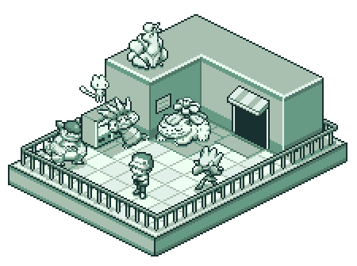

<!--
**maxwelldemaio/maxwelldemaio** is a ✨ _special_ ✨ repository because its `README.md` (this file) appears on your GitHub profile.

Here are some ideas to get you started:

- 🔭 I’m currently working on ...
- 🌱 I’m currently learning ...
- 👯 I’m looking to collaborate on ...
- 🤔 I’m looking for help with ...
- 💬 Ask me about ...
- 📫 How to reach me: ...
- 😄 Pronouns: ...
- ⚡ Fun fact: ...
-->

### Hi there, I'm <a href="https://github.com/maxwelldemaio">Max DeMaio</a> 👋

I'm a self-taught web-developer with a strong will to learn, research new technologies, and design architectural solutions. I like creating practical business solutions and making development processes as efficient as possible.

